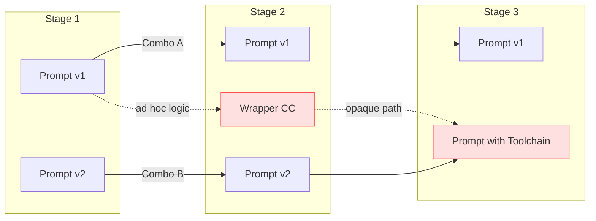

## Pain Scenario: Combinatorial Prompt Management

In modern AI orchestration flows, every stage owns its own prompt (often with multiple revisions or wrappers), so swapping a single prompt for an experiment is easy, but coordinating a full end-to-end combination of prompt variants is brittle: engineers end up hard-coding `if/else` ladders or tangled config files just to express pairings, the cross-stage combinations cannot be visualized or audited, and experiment runs rarely sync with product metrics, making it impossible to tell which compound prompt stack actually improved conversion, latency, or safety rates.

**Two Core Challenges**:

1. **Cross-Stage Version Composition**: Configuring and managing version combinations across multiple stages is operationally complex. Teams struggle to coordinate which prompt variant in Stage 1 should pair with which variants in Stage 2 and 3, leading to brittle hard-coded logic or unmaintainable configuration files.

2. **Metrics Testing for Combinations**: Testing and measuring metrics based on these cross-stage combinations is equally difficult. Without a systematic approach, it's nearly impossible to attribute changes in product metrics (conversion rates, latency, safety scores) to specific prompt combination experiments.

---

## Why Traditional LLM Observability Tools Fall Short

These pain points cannot be adequately solved by LLM observability tools like **Langfuse** or **Braintrust**. While these tools excel at tracing individual calls and logging prompt-response pairs, they lack the capability to:
- Systematically manage and route traffic across different prompt version combinations
- Execute controlled experiment rollouts with percentage-based traffic splits
- Correlate cross-stage prompt combinations directly with business and product metrics

## The Agent Flag Solution

A better approach leverages **feature flag logic** to build an **Agent Flag** system specifically designed for AI orchestration:

### Core Capabilities
1. **Single-Stage Prompt Versioning**: Enable/disable or gradually roll out individual prompt variants within a single task or stage
2. **Combinatorial Stage Management**: Define and control multi-stage prompt combinations as cohesive experiments
3. **Experiment Rollout**: Deploy prompt combinations to specific user segments or percentage-based traffic splits
4. **Metric Integration**: Directly tie prompt combination experiments to product KPIs, conversion funnels, and performance metrics

### Business Impact
By implementing an Agent Flag system, teams can:
- **Optimize Prompt Performance**: Systematically test and iterate on both individual prompts and full orchestration flows
- **Accelerate AI Workflow Improvement**: Move from ad-hoc testing to data-driven experimentation
- **Enhance Product Quality**: Make evidence-based decisions about which prompt strategies actually improve user outcomes
- **Drive Growth**: Continuously refine AI-powered features based on real product metrics and business results
