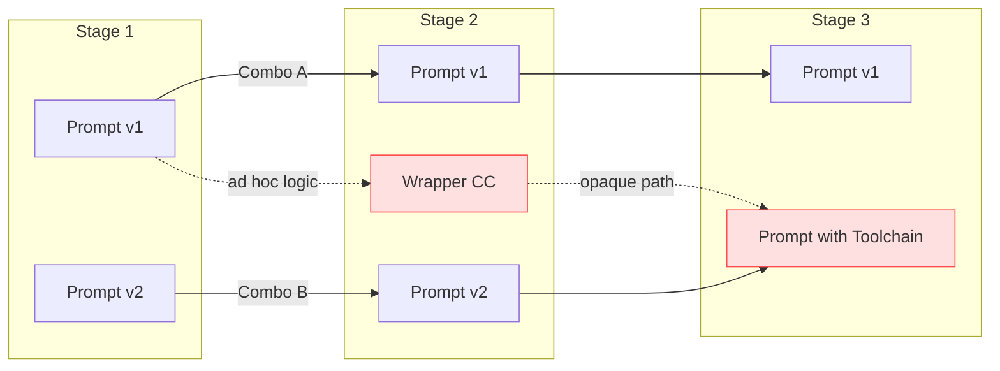
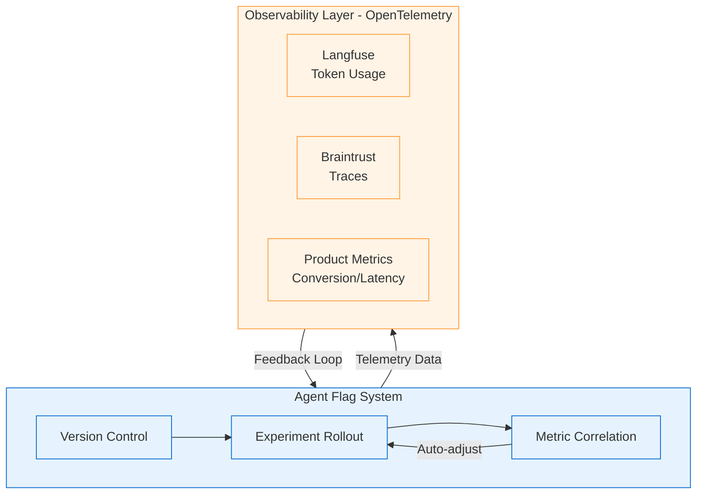
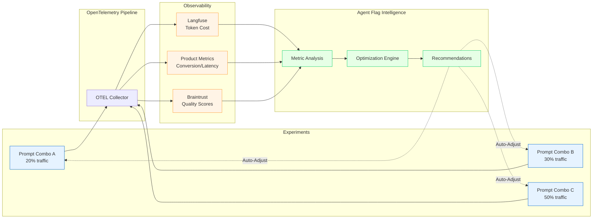
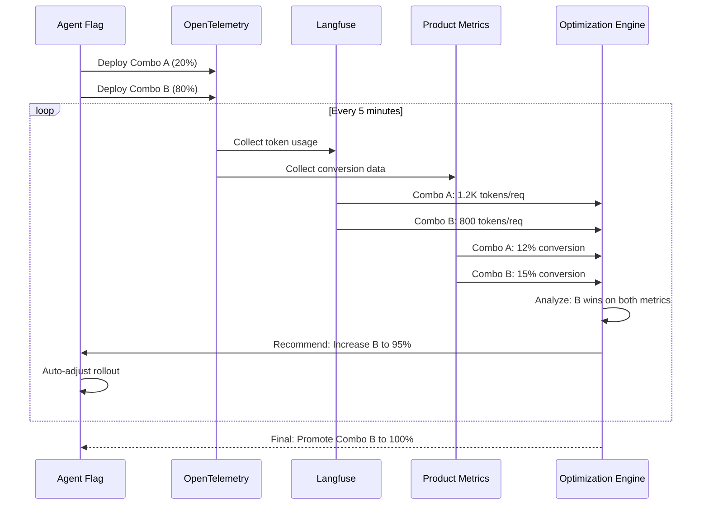
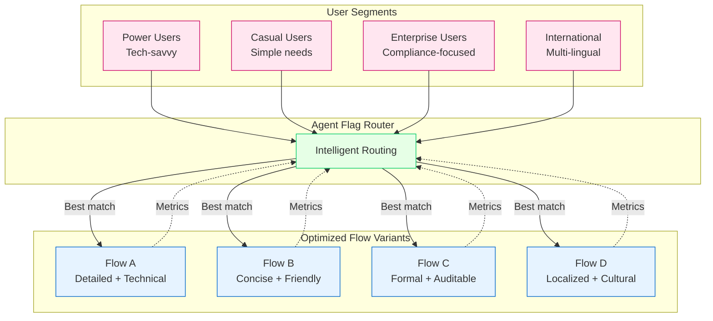
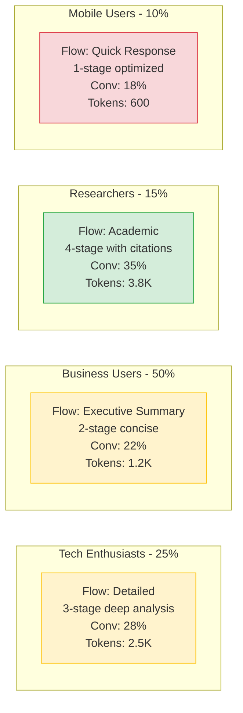

# Agent Flag: Intelligent AI Workflow Experimentation

## Table of Contents

1. [Pain Scenario: Combinatorial Prompt Management](#pain-scenario-combinatorial-prompt-management)
   - [Two Core Challenges](#two-core-challenges)
2. [Why Traditional LLM Observability Tools Fall Short](#why-traditional-llm-observability-tools-fall-short)
3. [The Agent Flag Solution](#the-agent-flag-solution)
   - [Core Capabilities](#core-capabilities)
   - [Business Impact](#business-impact)
4. [Autonomous Experimentation Through OpenTelemetry Integration](#autonomous-experimentation-through-opentelemetry-integration)
   - [Autonomous Capabilities](#autonomous-capabilities)
5. [Personalization at Scale: Multi-Variant Optimization](#personalization-at-scale-multi-variant-optimization)
   - [The Multi-Persona Challenge](#the-multi-persona-challenge)
   - [Thousand Faces, Thousand Flows](#thousand-faces-thousand-flows)
   - [Real-World Example](#real-world-example)
6. [Summary: The Agent Flag Advantage](#summary-the-agent-flag-advantage)

---

## Pain Scenario: Combinatorial Prompt Management

In modern AI orchestration flows, every stage owns its own prompt (often with multiple revisions or wrappers), so swapping a single prompt for an experiment is easy, but coordinating a full end-to-end combination of prompt variants is brittle: engineers end up hard-coding `if/else` ladders or tangled config files just to express pairings, the cross-stage combinations cannot be visualized or audited, and experiment runs rarely sync with product metrics, making it impossible to tell which compound prompt stack actually improved conversion, latency, or safety rates.

**Two Core Challenges**:

1. **Cross-Stage Version Composition**: Configuring and managing version combinations across multiple stages is operationally complex. Teams struggle to coordinate which prompt variant in Stage 1 should pair with which variants in Stage 2 and 3, leading to brittle hard-coded logic or unmaintainable configuration files.

2. **Metrics Testing for Combinations**: Testing and measuring metrics based on these cross-stage combinations is equally difficult. Without a systematic approach, it's nearly impossible to attribute changes in product metrics (conversion rates, latency, safety scores) to specific prompt combination experiments.

---

## Why Traditional LLM Observability Tools Fall Short

These pain points cannot be adequately solved by LLM observability tools like **Langfuse** or **Braintrust**. While these tools excel at tracing individual calls and logging prompt-response pairs, they lack the capability to:
- Systematically manage and route traffic across different prompt version combinations
- Execute controlled experiment rollouts with percentage-based traffic splits
- Correlate cross-stage prompt combinations directly with business and product metrics

## The Agent Flag Solution

A better approach leverages **feature flag logic** to build an **Agent Flag** system specifically designed for AI orchestration:

### Core Capabilities
1. **Single-Stage Prompt Versioning**: Enable/disable or gradually roll out individual prompt variants within a single task or stage
2. **Combinatorial Stage Management**: Define and control multi-stage prompt combinations as cohesive experiments
3. **Experiment Rollout**: Deploy prompt combinations to specific user segments or percentage-based traffic splits
4. **Metric Integration**: Directly tie prompt combination experiments to product KPIs, conversion funnels, and performance metrics

### Business Impact
By implementing an Agent Flag system, teams can:
- **Optimize Prompt Performance**: Systematically test and iterate on both individual prompts and full orchestration flows
- **Accelerate AI Workflow Improvement**: Move from ad-hoc testing to data-driven experimentation
- **Enhance Product Quality**: Make evidence-based decisions about which prompt strategies actually improve user outcomes
- **Drive Growth**: Continuously refine AI-powered features based on real product metrics and business results

---

## Autonomous Experimentation Through OpenTelemetry Integration

By integrating **OpenTelemetry** as the telemetry backbone, Agent Flag can bridge the gap between experimentation and observability, creating a closed-loop autonomous optimization system.

### Autonomous Capabilities

**1. Intelligent Rollout Management**
- Monitor real-time metrics from multiple observability sources
- Automatically adjust traffic distribution based on:
  - **Token consumption** patterns from Langfuse
  - **Product KPIs** (conversion rates, user satisfaction)
  - **Quality scores** from evaluation frameworks
- Progressively promote winning combinations while safely deprecating underperformers

**2. Self-Optimizing Experimentation**
- **Continuous Evaluation**: Run automated eval cycles on each prompt combination
- **Anomaly Detection**: Identify degraded performance or cost spikes early
- **Dynamic Adjustment**: Scale back failing experiments, accelerate successful ones
- **Cost Optimization**: Balance quality improvements against token/compute costs

**3. Actionable Insights & Recommendations**
- **Prompt Optimization Suggestions**: "Combo B achieves 15% better conversion with 20% lower token usage"
- **Workflow Improvements**: "Stage 2 bottleneck detected - consider parallel execution for Prompt v3"
- **Segment-Specific Tuning**: "User segment 'power users' responds better to Combo C"

---

## Personalization at Scale: Multi-Variant Optimization

In the AI era, one-size-fits-all approaches are obsolete. Modern AI products must deliver **personalized experiences** tailored to diverse user behaviors, contexts, and preferences.

### The Multi-Persona Challenge

### Thousand Faces, Thousand Flows

Rather than forcing all users through a single "optimal" workflow, Agent Flag enables:

**1. Segment-Specific Optimization**
- Maintain multiple production-grade prompt combinations simultaneously
- Each variant optimized for specific user cohorts or usage patterns
- Continuous A/B testing within segments to refine performance

**2. Context-Aware Routing**
- Route users to the workflow variant that historically performs best for their profile
- Adapt based on:
  - User expertise level
  - Industry/domain context
  - Language and cultural preferences
  - Device/platform constraints
  - Time sensitivity

**3. Perpetual Optimization**
- Every segment runs independent experiments
- Winning strategies in one segment can inspire variants for others
- Gradual evolution of each flow based on its specific audience

### Real-World Example

**Outcome**: Instead of averaging to a 23% conversion across all users, each segment gets its optimal experience, resulting in a blended 26% overall conversion while maintaining cost efficiency through per-segment token optimization.

---

## Summary: The Agent Flag Advantage

Agent Flag transforms AI workflow management from reactive to proactive, from monolithic to personalized:

1. **Unified Experimentation**: Seamlessly manage both single-prompt and multi-stage combinations
2. **Autonomous Intelligence**: Self-optimizing rollouts based on integrated observability data
3. **Cost-Aware Optimization**: Balance quality, latency, and token consumption automatically
4. **Segment Personalization**: Maintain multiple optimal flows for diverse user populations
5. **Continuous Evolution**: Never stop improving - every interaction feeds the optimization loop

This is the future of AI product development: intelligent, adaptive, and relentlessly focused on delivering the best possible experience to every user.
