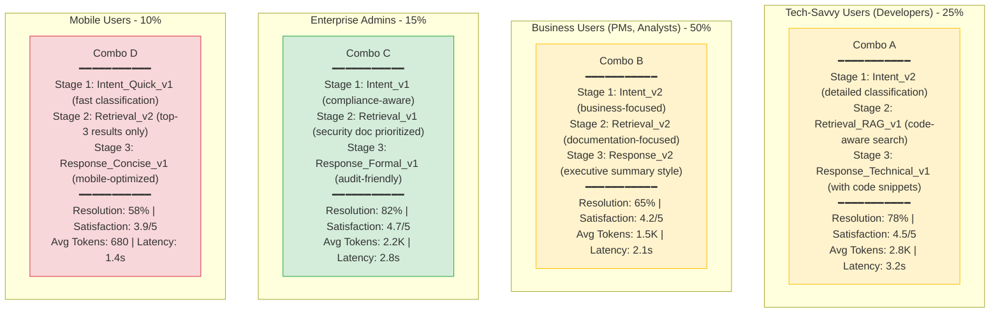

# Agent Flag: Intelligent AI Workflow Experimentation

## Table of Contents

1. [Pain Scenario: Combinatorial Prompt Management](#pain-scenario-combinatorial-prompt-management)
   - [Two Core Challenges](#two-core-challenges)
2. [Why Traditional LLM Observability Tools Fall Short](#why-traditional-llm-observability-tools-fall-short)
3. [The Agent Flag Solution](#the-agent-flag-solution)
   - [Core Capabilities](#core-capabilities)
   - [Business Impact](#business-impact)
4. [Autonomous Experimentation Through OpenTelemetry Integration](#autonomous-experimentation-through-opentelemetry-integration)
   - [Autonomous Capabilities](#autonomous-capabilities)
5. [Personalization at Scale: Multi-Variant Optimization](#personalization-at-scale-multi-variant-optimization)
   - [The Multi-Persona Challenge](#the-multi-persona-challenge)
   - [Thousand Faces, Thousand Flows](#thousand-faces-thousand-flows)
   - [Real-World Example](#real-world-example)
6. [Summary: The Agent Flag Advantage](#summary-the-agent-flag-advantage)

---

## Pain Scenario: Combinatorial Prompt Management

In modern AI orchestration flows, every stage owns its own prompt (often with multiple revisions or wrappers), so swapping a single prompt for an experiment is easy, but coordinating a full end-to-end combination of prompt variants is brittle: engineers end up hard-coding `if/else` ladders or tangled config files just to express pairings, the cross-stage combinations cannot be visualized or audited, and experiment runs rarely sync with product metrics, making it impossible to tell which compound prompt stack actually improved conversion, latency, or safety rates.

**Example Workflow**: Customer Intent Analysis → Information Retrieval → Response Generation

**Two Types of Variations**:
- **Version Iterations** (e.g., `Intent_v1` → `Intent_v2`): Same task, same approach, but optimized prompt content (improved system/user prompts, refined instructions)
- **Strategy Alternatives** (e.g., `Retrieval_v1` vs `Retrieval_RAG_v1`): Same task goal (same input/output contract), but completely different implementation strategies (e.g., direct retrieval vs RAG pattern)

**Note**: Each stage independently manages its own prompt versions and strategy variants. The combinatorial challenge emerges when trying to systematically test how these cross-stage selections interact.

**Two Core Challenges**:

1. **Cross-Stage Version Composition**: Configuring and managing version combinations across multiple stages is operationally complex. Teams struggle to coordinate which prompt variant in Stage 1 should pair with which variants in Stage 2 and 3, leading to brittle hard-coded logic or unmaintainable configuration files.

2. **Metrics Testing for Combinations**: Testing and measuring metrics based on these cross-stage combinations is equally difficult. Without a systematic approach, it's nearly impossible to attribute changes in product metrics (conversion rates, latency, safety scores) to specific prompt combination experiments.

---

## Why Traditional LLM Observability Tools Fall Short

These pain points cannot be adequately solved by LLM observability tools like **Langfuse** or **Braintrust**. While these tools excel at tracing individual calls and logging prompt-response pairs, they lack the capability to:
- Systematically manage and route traffic across different prompt version combinations
- Execute controlled experiment rollouts with percentage-based traffic splits
- Correlate cross-stage prompt combinations directly with business and product metrics

## The Agent Flag Solution

A better approach leverages **feature flag logic** to build an **Agent Flag** system specifically designed for AI orchestration:

### Core Capabilities
1. **Single-Stage Prompt Versioning**: Enable/disable or gradually roll out individual prompt variants within a single task or stage
   - Example: Test `Intent_v1` vs `Intent_v2` in Stage 1 (Intent Analysis)
2. **Combinatorial Stage Management**: Define and control multi-stage prompt combinations as cohesive experiments
   - Example: Coordinate `Intent_v2` + `Retrieval_RAG_v1` + `Response_Structured_v1` as Combo A
3. **Experiment Rollout**: Deploy prompt combinations to specific user segments or percentage-based traffic splits
   - Example: Route 20% traffic to Combo A, 80% to baseline combination
4. **Metric Integration**: Directly tie prompt combination experiments to product KPIs, conversion funnels, and performance metrics
   - Example: Track how Intent_v2 + Retrieval_RAG_v1 combo affects resolution time and customer satisfaction

### Business Impact
By implementing an Agent Flag system, teams can:
- **Optimize Prompt Combinations**: Systematically test and iterate on stage-level prompt versions within the same workflow structure
- **Accelerate Workflow Improvement**: Move from ad-hoc single-prompt testing to coordinated multi-stage combination experimentation
- **Enhance Product Quality**: Make evidence-based decisions about which cross-stage prompt combinations actually improve user outcomes
- **Drive Growth**: Continuously refine AI-powered features by optimizing prompt selections at every workflow stage based on real product metrics

---

## Autonomous Experimentation Through OpenTelemetry Integration

By integrating **OpenTelemetry** as the telemetry backbone, Agent Flag can bridge the gap between experimentation and observability, creating a closed-loop autonomous optimization system.

### Autonomous Capabilities

**1. Intelligent Rollout Management**
- Monitor real-time metrics from multiple observability sources
- Automatically adjust traffic distribution based on:
  - **Token consumption** patterns from Langfuse
  - **Product KPIs** (conversion rates, user satisfaction)
  - **Quality scores** from evaluation frameworks
- Progressively promote winning combinations while safely deprecating underperformers

**2. Self-Optimizing Experimentation**
- **Continuous Evaluation**: Run automated eval cycles on each prompt combination
- **Anomaly Detection**: Identify degraded performance or cost spikes early
- **Dynamic Adjustment**: Scale back failing experiments, accelerate successful ones
- **Cost Optimization**: Balance quality improvements against token/compute costs

**3. Actionable Insights & Recommendations**
- **Prompt Optimization Suggestions**: "Combo B achieves 15% better conversion with 20% lower token usage"
- **Workflow Improvements**: "Stage 2 bottleneck detected - consider parallel execution for Prompt v3"
- **Segment-Specific Tuning**: "User segment 'power users' responds better to Combo C"

---

## Personalization at Scale: Multi-Variant Optimization

In the AI era, one-size-fits-all approaches are obsolete. Modern AI products must deliver **personalized experiences** tailored to diverse user behaviors, contexts, and preferences.

### The Multi-Persona Challenge

**Continuing our customer support workflow example**: All user segments go through the same 3-stage workflow (Intent Analysis → Info Retrieval → Response Generation), but optimal prompt combinations differ by segment.

### Thousand Faces, Thousand Flows

Rather than forcing all users through a single "optimal" prompt combination, Agent Flag enables **personalized stage-level prompt selection** within the same workflow structure.

**1. Segment-Specific Prompt Combinations**
- Maintain multiple production-grade **prompt version combinations** simultaneously for the same workflow structure
- Each combination optimized for specific user cohorts or usage patterns
- Example: Same 3-stage workflow, but Stage 1 uses Prompt v2 for power users vs. Prompt v1 for casual users
- Continuous A/B testing within segments to refine which prompt versions work best at each stage

**2. Context-Aware Prompt Routing**
- Route users to the **stage-prompt combination** that historically performs best for their profile
- Same workflow stages, different prompt versions selected based on:
  - User expertise level (technical vs. simplified prompts)
  - Industry/domain context (specialized terminology vs. general language)
  - Language and cultural preferences (localized prompts)
  - Device/platform constraints (concise vs. detailed prompts)
  - Time sensitivity (quick response vs. thorough analysis prompts)

**3. Perpetual Combination Optimization**
- Every segment runs independent experiments on **stage-level prompt versions**
- Winning prompt choices in one stage can be tested across different user segments
- Gradual evolution of optimal prompt combinations for each audience, while maintaining the same workflow structure

### Real-World Example

**Scenario**: A SaaS company's customer support AI assistant handles technical inquiries through a fixed 3-stage workflow:
- **Stage 1**: Intent Analysis - Classify user intent (bug report, feature request, how-to question)
- **Stage 2**: Information Retrieval - Fetch relevant documentation, past tickets, or knowledge base articles
- **Stage 3**: Response Generation - Synthesize information into a helpful response

Each stage has multiple prompt versions and strategy variants. Agent Flag routes different user segments to optimal combinations:

**Key Insight**: All segments go through the **same 3-stage workflow structure** (Intent Analysis → Information Retrieval → Response Generation), but each stage selects different prompt versions based on user context.

**Detailed Breakdown**:
- **Developers** get technical, code-aware responses with RAG-enhanced retrieval → High satisfaction, higher token cost acceptable
- **Business Users** get concise, actionable summaries optimized for quick decisions → Balanced performance and cost
- **Enterprise Admins** get formal, compliance-ready responses with audit trails → Highest resolution rate for critical queries
- **Mobile Users** get ultra-fast, concise responses optimized for small screens → Lower resolution but acceptable for on-the-go usage

**Business Outcome**: Instead of forcing all users through a single "average" prompt combination (baseline: 68% resolution, 4.1/5 satisfaction, 1.8K tokens), each segment gets its optimal stage-prompt pairing:
- **Overall resolution rate improved to 71%** (from 68%)
- **Overall satisfaction improved to 4.3/5** (from 4.1/5)
- **Cost optimized**: High-value users (Enterprise Admins, Developers) use premium combos; mobile users use efficient combos
- **Total token efficiency**: 15% cost reduction through segment-specific optimization

---

## Summary: The Agent Flag Advantage

Agent Flag transforms AI workflow management from reactive to proactive, from monolithic to personalized:

1. **Unified Experimentation**: Seamlessly manage both single-stage prompt versions and cross-stage prompt combinations within the same workflow structure
2. **Autonomous Intelligence**: Self-optimizing rollouts based on integrated observability data, automatically adjusting which prompt versions are used at each stage
3. **Cost-Aware Optimization**: Balance quality, latency, and token consumption automatically by selecting optimal prompt combinations
4. **Segment Personalization**: Maintain multiple optimal stage-prompt combinations for the same workflow, tailored to diverse user populations
5. **Continuous Evolution**: Never stop improving - every interaction feeds the optimization loop, refining prompt selection at every stage

This is the future of AI product development: intelligent, adaptive, and relentlessly focused on delivering the best possible experience to every user through **precise stage-level prompt orchestration** within consistent workflow structures.
